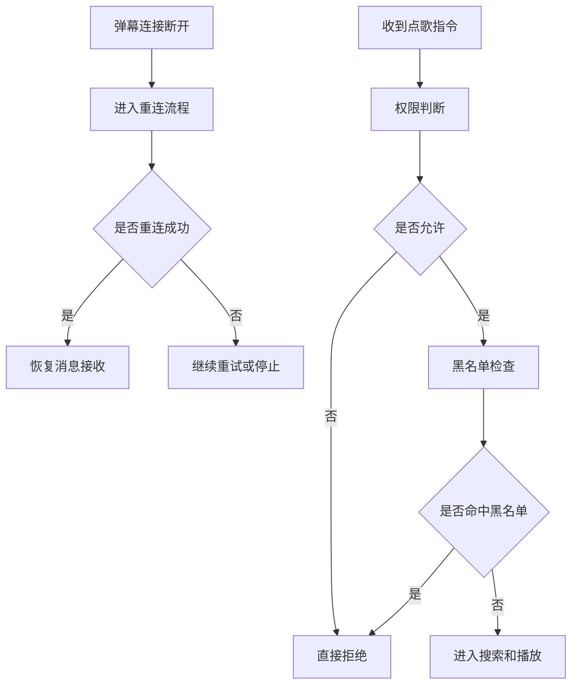

# AynaLivePlayer 定制改造方案

这份文档用于后续定制开发，目标是把三个需求拆成可逐步实现的模块：

1. B 站弹幕接口断线重连
2. 权限分类与限制策略
3. 歌曲黑名单

目前项目里已经有一部分现成能力，不需要从零开始。

## 1. 现状判断

### 1.1 弹幕接入

房间连接和消息分发主要在 [internal/liveroom/liveroom.go](internal/liveroom/liveroom.go) 和 [core/events/liveroom.go](core/events/liveroom.go)。

现在已有的能力是：

- 添加直播间
- 连接和断开直播间
- 接收弹幕消息并通过事件总线分发
- 配置自动连接

当前还缺少的是：

- 断线后自动重连
- 失败重试间隔控制
- 连续失败后的降级或停止策略
- 连接状态更明确的错误反馈

### 1.2 点歌权限

点歌插件在 [plugin/diange/diange.go](plugin/diange/diange.go) 里已经有基础限制：

- 普通用户权限
- 舰长或礼物舰队权限
- 管理员权限
- 粉丝牌等级限制
- 用户最大点歌数量限制
- 冷却时间限制

这说明权限并不是空白状态，而是已经有一个初步判断流程，只是现在逻辑是散的，后续适合抽成统一的权限策略层。

### 1.3 歌曲黑名单

黑名单已经存在，入口在 [plugin/diange/blacklist.go](plugin/diange/blacklist.go) 和 [plugin/diange/diange.go](plugin/diange/diange.go)。

现在已有的能力是：

- 添加黑名单项
- 选择精确匹配或包含匹配
- 点歌时做黑名单检查

当前还可以继续增强：

- 支持歌名黑名单、歌手黑名单、来源黑名单
- 支持正则或更灵活的模糊匹配
- 支持按用户或权限级别放行黑名单

## 2. 目标结构

建议把后续改造分成三个层：

### 2.1 连接层

负责直播间连接管理。

建议职责：

- 建立连接
- 监听断开
- 自动重连
- 重连状态通知

### 2.2 策略层

负责权限和限制判断。

建议职责：

- 判断当前用户属于哪个权限组
- 判断是否允许点歌
- 判断是否允许切歌
- 判断是否允许使用某个来源
- 判断是否触发次数限制或冷却限制

### 2.3 校验层

负责对歌曲内容做黑名单过滤。

建议职责：

- 检查歌名
- 检查歌手
- 检查来源
- 检查关键词

## 3. 推荐实现顺序

### 第一步：弹幕断线重连

这是最先做的，因为它影响整个系统输入。

建议改动点：

- 在房间状态回调里识别断开
- 增加一个重连协程或重试任务
- 设计重试次数和退避间隔
- 重新连接成功后恢复消息接收

建议优先修改：

- [internal/liveroom/liveroom.go](internal/liveroom/liveroom.go)
- [core/events/liveroom.go](core/events/liveroom.go)

### 第二步：权限分类

这是后续扩展性最关键的一层。

建议把现在散落在点歌、切歌、音量等插件里的判断，逐步统一成一个权限模型。

建议支持的权限维度：

- 指定用户
- 普通用户
- 粉丝牌等级
- 舰长或高等级用户
- 管理员或房管
- 自定义白名单

建议先改：

- [plugin/diange/diange.go](plugin/diange/diange.go)
- [plugin/qiege/qiege.go](plugin/qiege/qiege.go)
- [plugin/yinliang/yinliang.go](plugin/yinliang/yinliang.go)

如果后续要做得更干净，可以抽一个公共权限模块，再让各插件调用。

### 第三步：歌曲黑名单增强

这是最容易落地的一项，可以在现有黑名单基础上升级。

建议先支持：

- 歌曲标题黑名单
- 歌手黑名单
- 来源黑名单
- 精确和模糊两种匹配方式

后续再加：

- 正则表达式
- 用户例外名单
- 按权限级别绕过黑名单

建议改动点：

- [plugin/diange/blacklist.go](plugin/diange/blacklist.go)
- [plugin/diange/diange.go](plugin/diange/diange.go)

## 4. 依赖关系

这三个需求不是完全独立的，建议按下面的顺序组合：

1. 先保证弹幕连接稳定
2. 再做统一权限判断
3. 最后做歌曲内容黑名单

原因是：

- 没有稳定弹幕，后面的限制和黑名单都没有输入来源
- 权限和黑名单最终都要挂在点歌入口上
- 黑名单最好放在权限校验之后，这样逻辑更清晰

## 5. 建议的数据模型

### 5.1 权限配置

建议以后把权限配置整理成类似下面的结构：

- 用户白名单
- 房管权限
- 粉丝牌等级要求
- 舰长权限
- 管理员权限
- 允许的点歌来源
- 每类用户的最大点歌数
- 每类用户的冷却时间

### 5.2 黑名单配置

建议黑名单项至少包含：

- 匹配类型
- 匹配内容
- 是否启用
- 是否只对普通用户生效

### 5.3 重连配置

建议弹幕重连配置至少包含：

- 最大重试次数
- 初始重试间隔
- 最大间隔
- 是否自动重连
- 断开后是否立即提示

## 6. 实施草图



## 7. 预期收益

这样改完以后，项目会更适合继续定制：

- 连接更稳，不容易因为断线就丢弹幕
- 权限规则更统一，后面加新限制不需要到处改
- 黑名单更灵活，方便按业务规则屏蔽歌曲

## 8. 下一步建议

如果你确认这个方向，我下一步可以继续给你补一份更具体的开发清单，细到每个文件要做什么改动。

## 9. 详细需求定义

下面把你刚补充的需求拆成更明确的可实现规则，后续开发时优先按这个版本落地。

### 9.1 断线重连

#### 目标

弹幕房间断开后自动重连，避免临时网络波动导致功能中断。

#### 规则

- 最多尝试 3 次。
- 每次间隔 2 分钟。
- 3 次都失败后停止自动重连，并把状态交给界面或日志提示。
- 重连成功后恢复消息接收。

#### 建议补充的状态

- 当前是否处于重连中。
- 当前重连第几次。
- 最近一次断开原因。

#### 需要后续实现的点

- 断开事件检测。
- 重连调度器。
- 重连失败后的通知。

### 9.2 权限分类

#### 目标

不同用户可以拥有不同操作权限，既支持具体用户，也支持按身份分类管理。

#### 用户识别方式

- 具体用户：直接按名字判断。
- 分类用户：按身份类型判断。

#### 建议的身份分类

- 房管。
- 舰长。
- 灯牌等级。
- 管理员。
- 普通用户。

#### 灯牌等级映射

灯牌等级建议做成可配置的区间映射，并允许映射成具体的权限名字，例如：

- 无灯牌
- 低级灯牌
- 中等灯牌
- 高级灯牌

这样后续权限判断时，就可以直接按“权限名字”判断，而不是把等级数字散落在各个功能里。

#### 说明

- 具体用户优先级应高于分类权限。
- 分类权限用于批量管理，不需要逐个写用户名字。
- 后续可以继续扩展更多分类，但当前先把这些类型固定下来。
- 房管权限默认可以执行所有操作。
- 其他权限只可以对自己的歌曲执行相应操作。

#### 点歌数量限制

- 房管最多可以点 5 首歌。
- 其他人最多可以点 3 首歌。
- 这个限制和删除、上移、下移、换序等操作权限分开判断。

### 9.3 歌曲黑名单

#### 目标

限制某些歌曲被点播。

#### 规则

支持两类黑名单匹配：

- 歌曲标题包含某些文字。
- 歌手包含某些文字。

#### 说明

- 采用“包含”匹配，方便配置。
- 后续如果需要更严格的规则，可以再扩展成精确匹配或正则匹配。
- 黑名单命中后，相关歌曲请求直接拒绝。

### 9.4 权限可执行操作

权限不仅决定“能不能点歌”，还要决定“能执行哪些弹幕控制操作”。

#### 当前明确要做的操作

1. 删除某个歌曲。
2. 上移某首歌曲一个位置。
3. 下移某首歌曲一个位置。
4. 替换两首歌曲的位置。

#### 后续如果有必要再扩展

- 切歌。
- 调整音量。
- 清空列表。
- 跳过当前播放。

### 9.5 删除歌曲

#### 弹幕命令

用户输入：【删歌 数字】

#### 规则

- 数字从 1 开始。
- 数字对应当前列表中的歌曲序号。
- 当前播放歌曲不参与编号。
- 如果当前播放歌曲处于开始后的前 10 秒内，则删除操作不执行。
- 这样做是为了避免直播延迟带来的误操作。

#### 编号规则补充

- 第一首可播放歌曲作为编号 1。
- 每当当前播放歌曲切换到下一首时，编号对应的歌曲会随列表变化而变化。
- 也就是说，编号始终对应“当前待播队列”的实时顺序。

#### 行为建议

- 删除成功后给出提示。
- 删除失败时说明原因，例如：编号不存在、歌曲已接近结束、权限不足。

#### 需要确认的细节

- “当前列表”是否只指排队列表，不含正在播放的歌曲。
- 被删除歌曲是否要同步从历史或缓存中清理。

### 9.6 替换播放顺序

#### 弹幕命令

用户输入：【歌顺 数字 数字】

#### 规则

- 两个数字都从 1 开始。
- 表示把列表中的两首歌曲交换顺序。
- 默认不影响当前正在播放的歌曲。
- 交换操作只针对待播列表中的条目。

#### 行为建议

- 成功后返回新的顺序提示。
- 失败时提示编号无效或权限不足。

#### 需要确认的细节

- 如果其中一个编号超出列表范围，是否直接拒绝。
- 是否允许连续多次交换。

### 9.7 上移和下移

#### 弹幕命令

用户输入：【上移 数字】 或 【下移 数字】

#### 规则

- 每次只移动 1 个位置。
- 上移表示把指定歌曲往列表前面移动 1 位。
- 下移表示把指定歌曲往列表后面移动 1 位。
- 仍然只针对待播列表中的歌曲。

#### 行为建议

- 成功后返回新的顺序提示。
- 如果已经在最上面或最下面，则提示无法继续移动。

### 9.8 操作和权限的关系

建议把“谁能点歌”和“谁能操作列表”分开管理。

例如：

- 房管可以操作所有歌曲。
- 其他权限只可以操作自己的歌曲。
- 普通用户可能可以点歌，但不能删歌或调整别人的歌曲。
- 具体白名单用户可以获得更高权限。

#### 建议的权限-操作矩阵

- 房管：点歌、删歌、上移、下移、换序，全部可执行。
- 具体白名单用户：按配置决定，默认可视为高权限用户。
- 普通用户：只能对自己的歌曲执行允许的操作。
- 黑名单命中的歌曲：直接拒绝，不进入操作流程。

这样后续规则会更清晰，不会把所有能力混成一个权限开关。

## 10. 默认开发口径

下面这些点目前已经确认，可以作为默认开发口径：

1. 删除歌曲时，编号只按排队列表计算，第一首可播放歌曲为编号 1。
2. 删除歌曲前的判断窗是歌曲开始后的前 10 秒。
3. “歌顺 数字 数字”改为两首歌互换位置。
4. 另外新增 【上移 数字】 和 【下移 数字】，每次移动 1 个位置。
5. 灯牌等级采用可配置区间映射，并映射成具体权限名字。
6. 具体用户同时支持昵称和 UID，两个都要判断。
7. 黑名单只针对歌曲内容，不先扩展到其他操作来源。
8. 权限不足时不需要弹幕提示，保留日志即可。

## 11. 建议补充的实现口径

为了后面真正写代码时少走弯路，建议再补几条统一口径。

### 11.1 指令优先级

建议把弹幕指令按下面的思路处理：

- 先识别是否是操作类指令，再识别是否是点歌类指令。
- 同一条弹幕如果同时命中多个规则，优先按更具体的指令处理。
- 例如【删歌】、【上移】、【下移】、【歌顺】应优先于普通点歌关键字。

### 11.2 统一日志口径

建议后续所有权限拒绝、黑名单命中、重连失败都至少写日志，便于排查问题。

建议日志里尽量包含：

- 用户名和 UID。
- 触发的指令。
- 命中的权限类型或黑名单项。
- 当前列表编号或歌曲信息。
- 失败原因。

### 11.3 权限判断顺序

建议权限判断顺序固定下来，避免不同功能各写各的：

1. 具体用户。
2. 分类权限。
3. 灯牌等级映射。
4. 具体操作权限。

这样以后新增权限项时，能直接插入到统一流程里。

## 12. 播放状态持久化

### 12.1 目标

关闭程序时自动保存当前播放状态，下次启动时恢复，实现无缝续播。

### 12.2 规则

- 关闭程序时保存当前歌曲和待播列表到 `./config/play_state.json`。
- 启动时若存在保存文件，则恢复播放状态。
- 恢复时立即订阅 PlayerPlayingUpdate 捕获播放器就绪信号，然后延迟 10 秒执行恢复；若延迟期间已收到 Removed=false 信号则直接恢复，否则最多再等 30 秒。
- 播放器就绪后，将当前歌曲 + 待播列表一次性插入 PlayerPlaylist，设 Index=0，通过 PlayerPlayNextCmd 从当前歌曲开始续播。
- 恢复完成后删除 play_state.json。
- 运行时不做任何保存，只在关闭时保存。

### 12.3 数据结构

```json
{
  "current_song": { Media 对象 },
  "pending_playlist": [ Media 对象列表 ],
  "playlist_index": 0,
  "saved_at": "ISO 8601 时间戳"
}
```

### 12.4 实现要点

- 新增文件 `internal/player/state_persist.go`。
- 入口函数 `InitPlayStatePersistence()` 和 `SavePlayState()` 通过 `internal/auto_actions.go` 的 `InitAutoActions()` / `SaveAutoActions()` 间接调用，`internal.go` 不再直接依赖 player 持久化 API。
- 通过 `PlayerPlayCmd` 事件追踪当前播放歌曲。
- 恢复时逐首打印待播歌曲详情（仅 verbose 模式）。

### 12.5 已知问题与处理

- **文件锁冲突**：保存时检查文件是否被占用，失败则跳过本次保存。
- **恢复时序混乱**：Controller 可能在恢复前消费列表导致列表被清空——通过延迟等待播放器就绪 + `saveEnabled` 守卫解决。
- **播放器未就绪**：通过 PlayerPlayingUpdate 信号检测播放器状态，避免恢复时播放器尚未初始化。


