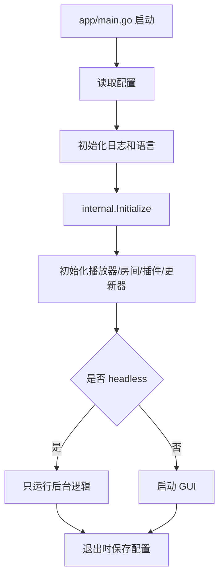

# AynaLivePlayer 项目基础结构说明

## 1. 这个项目是做什么的

AynaLivePlayer 是一个用 Go 写的桌面程序，主要用途是接收 B 站弹幕指令，然后根据指令去控制点歌、播放、列表和相关辅助功能。

它不是单纯的命令行程序，而是一个带图形界面的桌面应用。项目启动后会先加载配置、初始化服务和事件系统，再进入 GUI 或 headless 模式。

## 2. 启动入口

主入口在 [app/main.go](app/main.go)。

启动时大致会做这些事：

1. 读取配置文件。
2. 初始化日志、语言、事件总线。
3. 初始化内部服务，例如播放器、房间连接、插件、更新器等。
4. 如果是普通模式，就启动图形界面；如果是 headless 模式，就只运行后台逻辑。
5. 程序退出时保存配置并关闭各个模块。

## 3. 核心分层

这个项目可以先理解成 5 层：

### 3.1 app

这里放程序入口。当前最重要的是 [app/main.go](app/main.go)，负责总启动流程。

### 3.2 internal

这里是内部初始化层，负责把底层模块串起来。比如：

- 播放器初始化
- 弹幕源初始化
- 播放列表初始化
- 控制器初始化
- 插件系统初始化
- 系统媒体控制初始化

对应文件在 [internal/internal.go](internal/internal.go)。

### 3.3 core

这里更偏向业务核心逻辑和事件定义。可以把它理解成“项目的业务中枢”。

常见内容包括：

- 事件定义和映射
- 播放控制
- 歌词和属性处理
- 搜索逻辑
- 列表和房间相关模型

### 3.4 gui

这里是界面层，负责把功能展示给用户。主界面在 [gui/gui.go](gui/gui.go)，它会创建窗口、页面标签、系统托盘和错误弹窗。

主窗口包含 6 个标签页，各标签页在 `gui/gui.go` 的 `Initialize()` 中通过 `container.NewAppTabs` 创建，入口与源文件对应如下：

| 标签页 | 入口调用 | 源文件 | 说明 |
|--------|----------|--------|------|
| 播放器 | `player.CreateView()` | [gui/views/player/player.go](gui/views/player/player.go) | 播放控制界面，同目录还包含 controller.go、handler.go、lyric.go、playlist.go、videoplayer.go |
| 搜索 | `search.CreateView()` | [gui/views/search/search.go](gui/views/search/search.go) | 媒体搜索界面，同目录还包含 search_bar.go、search_list.go |
| 直播间 | `liverooms.CreateView()` | [gui/views/liverooms/liverooms.go](gui/views/liverooms/liverooms.go) | 直播间连接管理界面，同目录还包含 selector.go |
| 播放列表 | `playlists.CreateView()` | [gui/views/playlists/playlists.go](gui/views/playlists/playlists.go) | 播放列表管理界面 |
| 播放历史 | `history.CreateView()` | [gui/views/history/view.go](gui/views/history/view.go) | 播放历史记录界面 |
| 设置 | `configView.CreateView()` | [gui/views/config/config_basic.go](gui/views/config/config_basic.go) | 系统配置与插件设置界面，同目录还包含 config_layout.go |

### 3.5 pkg 和 plugin

这两部分可以看成基础能力和扩展能力：

- `pkg`：通用组件，例如配置、日志、事件总线、国际化等。
- `plugin`：具体插件实现，例如点歌、切歌、音量、登录、房间信息、WebSocket Hub 等。

## 4. 主要目录说明

### 4.1 config 和 assets

- [config/](config/)：配置文件目录，里面放 JSON 配置。
- [assets/](assets/)：字体、翻译文件等静态资源。

### 4.2 internal

这个目录是程序启动后真正会用到的核心运行时逻辑：

- [internal/player/](internal/player/)：播放器相关实现。
- [internal/playlist/](internal/playlist/)：播放列表处理。
- [internal/controller/](internal/controller/)：控制逻辑。
- [internal/liveroom/](internal/liveroom/)：直播间或弹幕房间相关逻辑。
- [internal/plugins/](internal/plugins/)：插件框架。
- [internal/source/](internal/source/)：数据来源抽象。

### 4.3 gui

界面代码按功能拆分成多个视图，例如：

- `gui/views/player`
- `gui/views/search`
- `gui/views/liverooms`
- `gui/views/playlists`
- `gui/views/history`
- `gui/views/config`

### 4.4 plugin

这里是具体功能插件，通常一个插件负责一个独立能力：

- `diange`：点歌
- `qiege`：切歌
- `yinliang`：音量控制
- `sourcelogin`：来源登录
- `textinfo`：文本信息输出
- `durationmgmt`：时长控制
- `wshub`：WebSocket 连接或消息桥接

## 5. 配置和数据流

程序启动时会读取 [pkg/config/config.go](pkg/config/config.go) 中定义的配置系统，默认配置和运行配置会映射到结构体中。

配置的常见数据来源有两类：

- `config.ini`：主配置文件。
- `assets/` 和 `config/` 下的 JSON 文件：例如房间、播放列表、翻译等数据。

整体数据流可以简单理解为：

1. 弹幕或外部事件进入系统。
2. 事件总线分发消息。
3. 插件或控制器接收消息并处理。
4. 播放器或界面执行相应动作。

## 6. 启动流程概览

可以把程序启动过程理解成下面这个顺序：

## 7. 你后期最可能改的地方

如果你后面要做定制，通常最常动的是这些地方：

- 想改界面：先看 [gui/](gui/)
- 想改点歌或指令逻辑：先看 [plugin/](plugin/) 和 [internal/controller/](internal/controller/)
- 想改播放器行为：先看 [internal/player/](internal/player/) 和 [core/](core/)
- 想改配置项：先看 [pkg/config/](pkg/config/)

## 8. 一句话总结

这个项目的结构可以先记成一句话：

“入口在 app，核心初始化在 internal，业务逻辑在 core，界面在 gui，可扩展能力在 plugin，通用基础能力在 pkg。”
